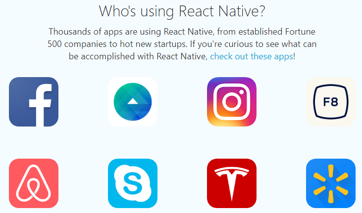
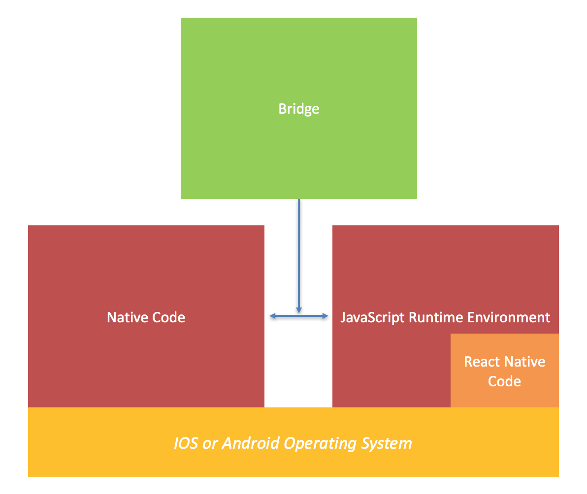

---
presentation:
  width: 1440
  height: 1280
  controls: false
---
<!-- slide -->
React Native
"Learn Once, Write Anywhere"

<!-- slide -->
Overview

* What is React Native
* Learn Once, Write Anywhere

* What is Expo
* How does React-Native work
* How does Expo work
* Hot Reload
* Static Checkers
  * flow
  * typescript
* Flexbox
* Shared Javascript with Server/Cloud
* Hooks to Native
  * Swift/Objective-C
  * Java/Kotlin
  * C/C++
* Available libraries
  * Maps (Google/Apple, etc.)
  * Vector-icons, Fonts, etc.
  * Buttons, video players, GPS trackers, etc.
* jsx examples

<!-- slide -->
### What is React-Native?

* Javascript engine for Mobile with direct hooks to native components supported on the mobile platform.
* iOS, Android, Windows Phone (in a branch)
* A React-Native App has literally ~~NO~~ one limitation~~s~~, as its support for native libraries means if you are lacking native support, you can implement it yourself.  <span style="font-size: 0.5em;">This is a lie - it is not suitable for anything with dynamic animations based on user feedback, like games, **yet**...</span>

#### Motto
~~Write Once, Run Anywhere~~
Learn Once, Write Anywhere

<!-- slide -->
### Where does it come from?

- Developed by Facebook
- Dogfooded by Facebook for Facebook app, Messenger, etc.
- Released open-source by Facebook to the world on one condition:
  - *You may not sue Facebook for patent infringement*
- Used by Facebook, WIX, Instagram, Uber, Discord, Bloomberg, Discovery VR, ...



<!-- slide -->
### How does it work I ?


<!-- slide -->
### How does it work II ?
</img>
- Runtime Environment: Javascript Core
- Most React-Native controls interact with a native counterpart
  - Pure-javascript components are obviously also supported and inherently cross-platform (but with a performance penalty, and they won't "look" native)
- React Native provides the bridge between JS and native
  - Events passed through the bridge between JS and native
- Native code runs in its own thread, so it won't block the UI thread.

<!-- slide -->
### How does it work III ?
</img>
- Pure Android/iOS application is compiled from source and deployed to phone. This application includes all necessary native components, including native Java/Kotlin/Obj-C/Swift/C++ libraries needed by the javascript.
- Node web server runs which holds all of the React-Native JavaScript code.
- In Debug mode, the JavaScript code bundled and transferred from the development PC to the phone via USB/WIFI/Ethernet/etc...
  - This enables **live reload** and **hot reload** on changes to the JavaScript UX.
- In Release mode, the JavaScript code is bundled as a blob included in the release app.


<!-- slide data-notes=
"Write your note here"
-->
<!-- slide -->
### Why use React-Native (Pros)
- Rapid development
- Learn once, write anywhere
- "Normal" apps are not limited by the provided RN API
  - Huge community of 3rd party modules
  - Roll your own native modules
- Lean UX development
- Share javascript code between server and client
- One development team needed with Javascript competence, rather than separate Android/iOS teams
- Use native views, buttons, lists, video-players, camera app, gallery app, maps, etc, but from javascript, with the speed and integration that this entails.

<!-- slide -->
### React-Native Cons
- Environment setup
- Developing in Windows is a piece of #@&%!
  - Slow build time
  - Can only build for Android
  - Path length limitations in Windows OS
- **Dependencies must be continually updated**
  - Android Dependencies
    - Android Studio, Android Build Tools, Gradle, Java, Kotlin, Gradle, Gradle, Gradle
  - XCode Dependencies
    - Swift language, Swift libraries, Swift deprecation
  - RN Dependencies.
    - Need latest RN to support latest XCode to support latest iPhone, but latest RN breaks native module camera, GPS, and maps.
    - Need latest RN to support latest Android Studio, but that breaks native module soundplayer, imageshrinker, and cow pusher.
  - Workaround 1: Most 3rd party modules are published on github, so you can wait until the author publishes a fix, or fix it yourself and be a hero.
  - Workaround 2: Wait before upgrading your build tools/XCode/Android Studio
  - Workaround 3: Lock all native module versions and javascript in your package.lock.
  - Workaround 4: Use **Expo**

<!-- slide -->
### Example App 1
Setup:
Install the tools necessary to create a template React Native project from the command line.

```bash
npm install -g react-native-cli
```

- Create a new React-Native project called "AwesomeProject"

```bash

react-native init AwesomeProject
cd AwesomeProject
```

To build and run your new app on iOS:
```bash
react-native run-ios
```

To build and run your new app on Android:
```bash
react-native run-android
```

<!-- slide -->
### Example App 1
```javascript
TODO put the app code here.

```

<!-- slide data-notes=
"Expo uses npm install -g create-react-native-app"
create-react-native-app AwesomeExpoProject
-->

<!-- slide -->
This is slide 2
